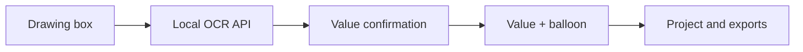

# Doc OCR Box

Local engineering-drawing OCR and ballooning application. The browser renders
PDF/image drawings and stores annotations; a local Python API runs PaddleOCR and
symbol recovery. No cloud OCR service is required.

## Current workflow

1. Open a PDF or image with **Open Drawing**.
2. Choose **Draw Value** and draw a box around one dimension or note.
3. Review the OCR result in the **Extracted Value** dialog.
4. Correct Value or Tolerance if required, then select **OK**.
5. Edit the same balloon later from the drawing or **Values** sidebar.
6. Optionally add Label, Method, and Tool metadata.
7. Save a reloadable `.docbox.json` project or export JSON, CSV, XML, a Digital
   Checksheet template, or a verification payload.

The box saved with a manually created value is the box drawn by the user.
Balloon numbers are always contiguous `1…N`; deleting a value immediately
renumbers the remaining values. Labels are optional metadata and do not create
separate boxes or balloons.

Numeric values without an explicit tolerance default to `0`. Complete decimal
or angular tolerances embedded in Value are normalized into the editable
Tolerance field. Malformed or incomplete tolerance expressions must be
corrected before a saved annotation can be exported.



## Quick start

Requirements:

- Node.js 20.19 or newer (required by the frontend test toolchain)
- 64-bit CPython 3.13 for the validated Windows OCR environment

Install the UI dependencies:

```bash
npm install
```

Create the Python environment and install the OCR backend:

```bash
python -m venv backend/.venv
backend/.venv/bin/python -m pip install -r backend/requirements.txt
```

On Windows PowerShell or Command Prompt, use:

```bat
py -m venv backend\.venv
backend\.venv\Scripts\python -m pip install -r backend\requirements.txt
```

Start the two processes from the repository root:

```bash
# Terminal 1
npm run ocr-api

# Terminal 2
npm run dev
```

Open `http://localhost:3000`. Check `http://127.0.0.1:8000/health` if the
frontend cannot reach OCR. A healthy configured service reports
`"paddleocr": true`.

Windows also has a one-shot backend setup and launcher:

```bat
scripts\win-ocr-setup.bat
```

The `ocr-api`, `ocr-api:debug`, and `ocr-api:debug:force` commands choose the
correct virtual-environment Python path on Windows, macOS, and Linux.

## Drawing and OCR tips

- Include the full `Ø`, `±`, degree, minute, or second symbol inside the box.
- A tall, narrow box is valid for a vertical dimension; the backend evaluates
  rotated variants.
- If OCR misses a symbol, insert it with the buttons in the Value editor.
- OCR is PaddleOCR-only. The former Tesseract worker is not used.

## Balloon appearance

Balloon appearance is deployment-controlled, not user-configurable. Drawing
markers and sidebar thumbnails both load `public/balloon-style.json`. Replacing
that one file changes every existing and future balloon after refresh; style is
not embedded in saved projects.

See [docs/BALLOON_STYLE.md](docs/BALLOON_STYLE.md) for the developer builder,
validation, replacement, and fallback process.

## Testing

Install test dependencies and run the fast verification suite:

```bash
npm install
backend/.venv/bin/python -m pip install -r backend/requirements-dev.txt
npm run verify
```

Use the equivalent `backend\.venv\Scripts\python` path on Windows. OCR/model
integration tests are intentionally separate:

```bash
npm run test:ocr
```

See [docs/TESTING.md](docs/TESTING.md) for the command matrix, Windows manual
acceptance checklist, and explicitly deferred follow-ups.

## Project layout

| Path | Purpose |
|---|---|
| `src/` | Next.js UI, annotation state, persistence, and exports |
| `backend/` | FastAPI, PaddleOCR pipeline, image processing, and checksheet conversion |
| `public/balloon-style.json` | Single deployed balloon-style data file |
| `tools/balloon_builder/` | Developer-only artwork conversion and validation utility |
| `scripts/` | Cross-platform OCR and test launchers |
| `docs/` | Testing and balloon-style operating documentation |
