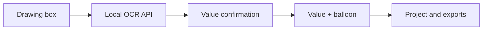

# Doc OCR Box

Local engineering-drawing OCR and ballooning application. The browser renders
PDF/image drawings and stores annotations; a local Python API runs PaddleOCR and
symbol recovery. No cloud OCR service is required.

## Current workflow

1. Open a PDF or image with **Open Drawing**.
2. Choose **Draw Value** and draw a box around one dimension or note.
3. Review the OCR result in the **Extracted Value** dialog.
4. Correct Value or Tolerance if required, then select **OK**.
5. Edit the same balloon later from the drawing or **Values** sidebar.
6. Optionally add Label, Method, and Tool metadata.
7. Save a reloadable `.docbox.json` project, create an internal inspection
   checksheet, or export JSON, CSV, XML, or a verification payload.

On a sheet with a coordinate point table, a whole-page scan also tags each of
its named points where the views call it out — see
[Reference points](#reference-points).

The box saved with a manually created value is the box drawn by the user.
Balloon numbers are always contiguous `1…N`; deleting a value immediately
renumbers the remaining values. Labels are optional metadata and do not create
separate boxes or balloons.

Numeric values without an explicit tolerance default to `0`. Complete decimal
or angular tolerances embedded in Value are normalized into the editable
Tolerance field. Malformed or incomplete tolerance expressions must be
corrected before a saved annotation can be exported.


```mermaid
flowchart LR
    A["Drawing box"] --> B["Local OCR API"]
    B --> C["Value confirmation"]
    C --> D["Value + balloon"]
    D --> E["Project and exports"]
```

## Quick start

Requirements:

- Node.js 20.19 or newer (required by the frontend test toolchain)
- 64-bit CPython 3.13 for the validated Windows OCR environment

Install the UI dependencies:

```bash
npm install
```

Create the Python environment and install the OCR backend:

```bash
python -m venv backend/.venv
backend/.venv/bin/python -m pip install -r backend/requirements.txt
```

On Windows PowerShell or Command Prompt, use:

```bat
py -m venv backend\.venv
backend\.venv\Scripts\python -m pip install -r backend\requirements.txt
```

Start the two processes from the repository root:

```bash
# Terminal 1
npm run ocr-api

# Terminal 2
npm run dev
```

Open `http://localhost:3000`. Check `http://127.0.0.1:8000/health` if the
frontend cannot reach OCR. A healthy configured service reports
`"paddleocr": true`.

Windows also has a one-shot backend setup and launcher:

```bat
scripts\win-ocr-setup.bat
```

The `ocr-api`, `ocr-api:debug`, and `ocr-api:debug:force` commands choose the
correct virtual-environment Python path on Windows, macOS, and Linux.

## Internal checksheets

Choose **Export → Checksheet / Web** after ballooning a drawing. Enter a
checksheet name and one or more measured-part columns. The backend saves an
immutable snapshot of the specifications, balloon geometry, and original
PDF/image, then opens the first draft inspection run.

Use **Saved Checksheets** in the main toolbar to search definitions, reopen
drafts, start another inspection, view completed history, rename, duplicate,
archive, restore, or permanently delete an archived checksheet. Completing a
run locks its readings.

By default, durable checksheet data is written below
`backend/data/checksheets/`. Set these variables in `.env.local` when deploying:

```dotenv
# Absolute or repo-relative backend storage location.
CHECKSHEET_DATA_DIR=D:\doc-ocr-data\checksheets

# Maximum accepted original drawing size in MB (default 200).
CHECKSHEET_MAX_DOCUMENT_MB=200
```

Keep `CHECKSHEET_DATA_DIR` on a backed-up server volume. Other computers access
it through the backend API; the browser is not the persistence layer for these
checksheets.

## Reference points

Some sheets carry a small table of named points — `a`, `b`, `c` … — each with
its X/Y/Z coordinates, and print the bare name beside the matching feature in
the views. **Auto Balloon → Whole Page** reads that table and tags every place
the views call one of its names out, showing all three coordinates on the
sheet. **Reference Points** runs the same pass on its own, without rescanning
for dimensions.

Selecting a row highlights its markers on the drawing, dims the rest, and
tints the matching row of the drawing's own printed table. Each row keeps its
own colour; the name is always printed on the marker, so colour is only a way
of finding a point, never the thing that identifies it.

The table is found from its header, never from a caption: a column of short
names with X/Y/Z columns to its right. "(REFERENCE)", "(参考)" and no caption
at all all work, and a sheet whose tables have no coordinate columns reports
that rather than guessing. Point names are then located by matching the
table's own printed glyphs against the drawing, so nothing has to generalize
across fonts or scanners.

Names the matcher could not find are listed and their rows are marked `?` —
the coordinates are still correct, only the callout was not located.

These are not ballooned values: they carry no tolerance, no inspection
method, and no balloon number, and they are not saved into a project or an
export. The sheet is re-rendered several times finer than an auto-balloon
scan for this, because point names are printed at note size — which is also
why the pass runs after the scan rather than sharing its render.

## Notes paragraphs

A drawing's NOTES paragraph is published as one **General Note** region, not
as one balloon per line. The detector breaks the same prose into word-sized
boxes, and the ones carrying a number — `R15`, a resonance frequency, a
standard's `500Y` — read as perfectly good engineering values on their own, so
every region a notes block covers is dropped in favour of the block.

Numbered markers are recognized in three shapes: `1.` / `1)`, a bare `1 WORD
WORD` with no separator, and a lone number box with the note's text beside it
(how wide-set CJK blocks come back). A sheet that prints its notes twice, once
per language, gets one region per block.

## Drawing and OCR tips

- Include the full `Ø`, `±`, degree, minute, or second symbol inside the box.
- A tall, narrow box is valid for a vertical dimension; the backend evaluates
  rotated variants.
- If OCR misses a symbol, insert it with the buttons in the Value editor.
- OCR is PaddleOCR-only. The former Tesseract worker is not used.

## Balloon appearance

Balloon appearance is deployment-controlled, not user-configurable. Drawing
markers and sidebar thumbnails both load `public/balloon-style.json`. Replacing
that one file changes every existing and future balloon after refresh; style is
not embedded in saved projects.

See [docs/BALLOON_STYLE.md](docs/BALLOON_STYLE.md) for the developer builder,
validation, replacement, and fallback process.

## Testing

Install test dependencies and run the fast verification suite:

```bash
npm install
backend/.venv/bin/python -m pip install -r backend/requirements-dev.txt
npm run verify
```

Use the equivalent `backend\.venv\Scripts\python` path on Windows. OCR/model
integration tests are intentionally separate:

```bash
npm run test:ocr
```

See [docs/TESTING.md](docs/TESTING.md) for the command matrix, Windows manual
acceptance checklist, and explicitly deferred follow-ups.

## Project layout

| Path | Purpose |
|---|---|
| `src/` | Next.js UI, annotation state, persistence, and exports |
| `backend/` | FastAPI, PaddleOCR, image processing, and durable checksheet storage |
| `public/balloon-style.json` | Single deployed balloon-style data file |
| `tools/balloon_builder/` | Developer-only artwork conversion and validation utility |
| `scripts/` | Cross-platform OCR and test launchers |
| `docs/` | Testing and balloon-style operating documentation |
